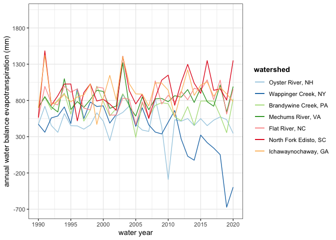
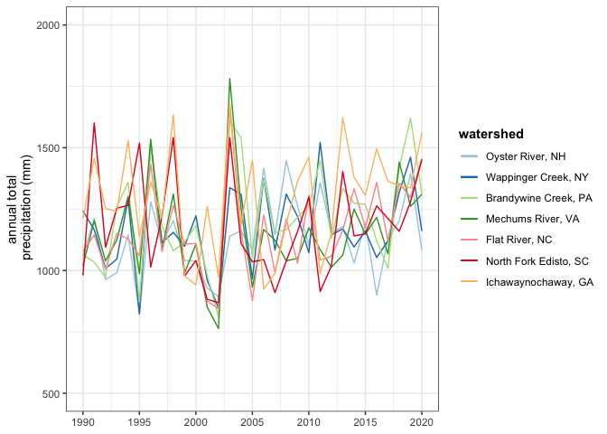
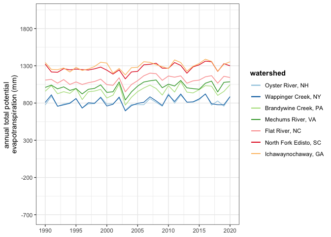
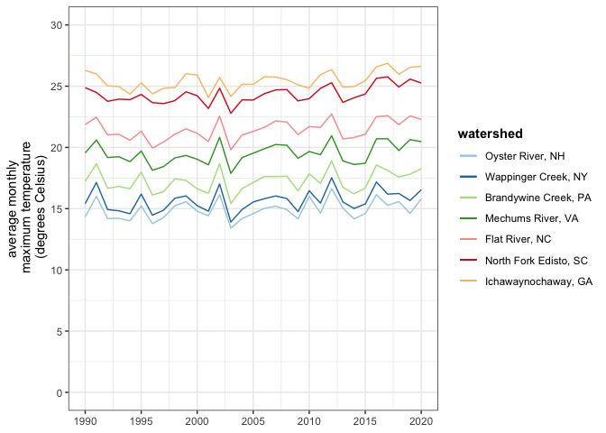
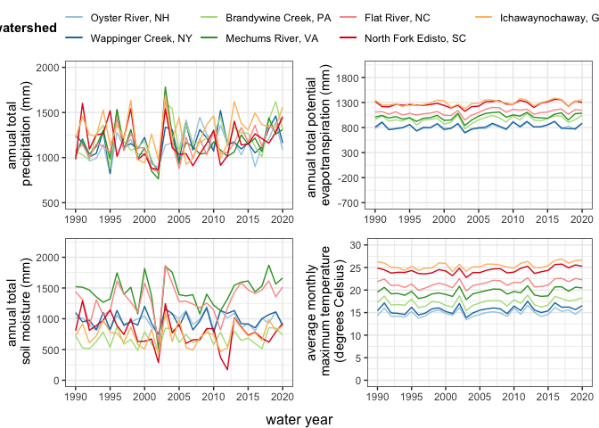
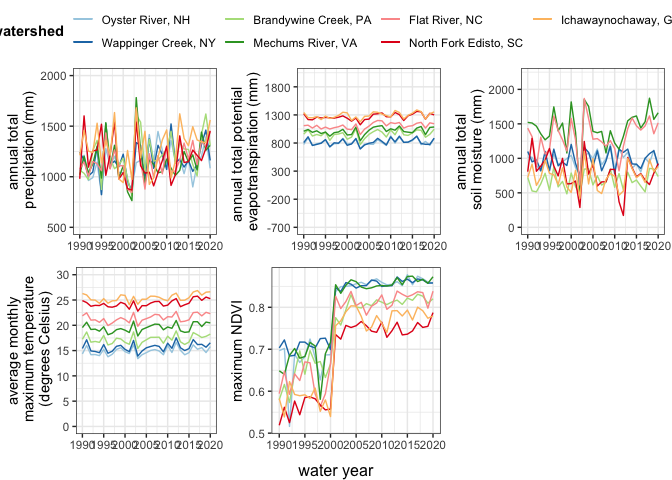

Figures and Figure Code
================

This is an R Markdown document of the process done to generate figures
for the project.

### Required packages and libraries:

``` r
library(tidyverse)
```

    ## ── Attaching packages ─────────────────────────────────────── tidyverse 1.3.2 ──
    ## ✔ ggplot2 3.4.0      ✔ purrr   0.3.5 
    ## ✔ tibble  3.1.8      ✔ dplyr   1.0.10
    ## ✔ tidyr   1.2.1      ✔ stringr 1.4.1 
    ## ✔ readr   2.1.3      ✔ forcats 0.5.2 
    ## ── Conflicts ────────────────────────────────────────── tidyverse_conflicts() ──
    ## ✖ dplyr::filter() masks stats::filter()
    ## ✖ dplyr::lag()    masks stats::lag()

``` r
library(ggplot2)
library(ggpubr)
```

### Read in the .csv files containing the data for each watershed:

``` r
# Note: file paths have to be changed by the user.

OysterNH_data <- read.csv("/Users/amyeldalecero/CEE_609_project/Model_train_and_validate_code/data/OysterNH_data.csv")
WappingerNY_data <- read.csv("/Users/amyeldalecero/CEE_609_project/Model_train_and_validate_code/data/WappingerNY_data.csv")
BrandywinePA_data <- read.csv("/Users/amyeldalecero/CEE_609_project/Model_train_and_validate_code/data/BrandywinePA_data.csv")
MechumsVA_data <- read.csv("/Users/amyeldalecero/CEE_609_project/Model_train_and_validate_code/data/MechumsVA_data.csv")
FlatNC_data <- read.csv("/Users/amyeldalecero/CEE_609_project/Model_train_and_validate_code/data/FlatNC_data.csv")
NorthForkSC_data <- read.csv("/Users/amyeldalecero/CEE_609_project/Model_train_and_validate_code/data/NorthForkSC_data.csv")
IchawayGA_data <- read.csv("/Users/amyeldalecero/CEE_609_project/Model_train_and_validate_code/data/IchawayGA_data.csv")
```

### PLOT: Annual water balance ET of each watershed

``` r
annual_WB_ET <- ggplot() +
  geom_line(data = OysterNH_data, (aes(x = water_year, y = WB_annual_total_aet, color = "Oyster River, NH"))) +
  geom_line(data = WappingerNY_data, (aes(x = water_year, y = WB_annual_total_aet, color = "Wappinger Creek, NY"))) +
  geom_line(data = BrandywinePA_data, (aes(x = water_year, y = WB_annual_total_aet, color = "Brandywine Creek, PA"))) +
  geom_line(data = MechumsVA_data, (aes(x = water_year, y = WB_annual_total_aet, color = "Mechums River, VA"))) +
  geom_line(data = FlatNC_data, (aes(x = water_year, y = WB_annual_total_aet, color = "Flat River, NC"))) +
  geom_line(data = NorthForkSC_data, (aes(x = water_year, y = WB_annual_total_aet, color = "North Fork Edisto, SC"))) +
  geom_line(data = IchawayGA_data, (aes(x = water_year, y = WB_annual_total_aet, color = "Ichawaynochaway, GA"))) +
  
  scale_color_manual(name = "watershed",
                     values = c("Oyster River, NH" = "#a6cee3",
                                "Wappinger Creek, NY" = "#1f78b4",
                                "Brandywine Creek, PA" = "#b2df8a",
                                "Mechums River, VA" = "#33a02c",
                                "Flat River, NC" = "#fb9a99",
                                "North Fork Edisto, SC" = "#e31a1c",
                                "Ichawaynochaway, GA" = "#fdbf6f"),
                     breaks = c("Oyster River, NH",
                               "Wappinger Creek, NY",
                               "Brandywine Creek, PA",
                               "Mechums River, VA",
                               "Flat River, NC",
                               "North Fork Edisto, SC",
                               "Ichawaynochaway, GA")) +
  
  scale_x_continuous(breaks = seq(1990, 2020, 5)) +
  scale_y_continuous(breaks = seq(-700, 2000, 500), limits = c(-700, 2000)) +
  
  labs(x = "water year",
       y = "annual water balance evapotranspiration (mm)") +
  
  theme_bw() +
  
  theme(legend.title = element_text(face = "bold"))

annual_WB_ET
```

<!-- -->
 

**Caption:** Annual evapotranspiration from water years 1990-2020
computed using the water balance method

``` r
# Export the plot as png

ggsave(filename = "annual_WB_ET.png",
       plot = annual_WB_ET,
       device = "png",
       path = '2_final_figures',
       width = 8,
       height = 4,
       units = "in",
       dpi = 200)
```

 

### PLOT: Annual precipitation

``` r
annual_RS_precip <- ggplot() +
  geom_line(data = OysterNH_data, (aes(x = water_year, y = RS_annual_total_precip, color = "Oyster River, NH"))) +
  geom_line(data = WappingerNY_data, (aes(x = water_year, y = RS_annual_total_precip, color = "Wappinger Creek, NY"))) +
  geom_line(data = BrandywinePA_data, (aes(x = water_year, y = RS_annual_total_precip, color = "Brandywine Creek, PA"))) +
  geom_line(data = MechumsVA_data, (aes(x = water_year, y = RS_annual_total_precip, color = "Mechums River, VA"))) +
  geom_line(data = FlatNC_data, (aes(x = water_year, y = RS_annual_total_precip, color = "Flat River, NC"))) +
  geom_line(data = NorthForkSC_data, (aes(x = water_year, y = RS_annual_total_precip, color = "North Fork Edisto, SC"))) +
  geom_line(data = IchawayGA_data, (aes(x = water_year, y = RS_annual_total_precip, color = "Ichawaynochaway, GA"))) +
  
  scale_color_manual(name = "watershed",
                     values = c("Oyster River, NH" = "#a6cee3",
                                "Wappinger Creek, NY" = "#1f78b4",
                                "Brandywine Creek, PA" = "#b2df8a",
                                "Mechums River, VA" = "#33a02c",
                                "Flat River, NC" = "#fb9a99",
                                "North Fork Edisto, SC" = "#e31a1c",
                                "Ichawaynochaway, GA" = "#fdbf6f"),
                     breaks = c("Oyster River, NH",
                               "Wappinger Creek, NY",
                               "Brandywine Creek, PA",
                               "Mechums River, VA",
                               "Flat River, NC",
                               "North Fork Edisto, SC",
                               "Ichawaynochaway, GA")) +
  
  scale_x_continuous(breaks = seq(1990, 2020, 5)) +
  scale_y_continuous(breaks = seq(500, 2000, 500), limits = c(500, 2000)) +
  
  labs(x = "water year",
       y = "annual total\n precipitation (mm)") +
  
  theme_bw() +
  
  theme(legend.title = element_text(face = "bold"),
        axis.title.x = element_blank())

annual_RS_precip
```

<!-- -->

**Caption:** Annual total precipitation from water years 1990-2020

``` r
# Export the plot as png

# ggsave(filename = "annual_RS_precip.png",
#        plot = annual_RS_precip,
#        device = "png",
#        path = '2_final_figures',
#        width = 8,
#        height = 4,
#        units = "in",
#        dpi = 200)
```

 

### PLOT: Annual total potential evapotranspiration

``` r
annual_RS_pet <- ggplot() +
  geom_line(data = OysterNH_data, (aes(x = water_year, y = (RS_annual_total_pet * 0.1), color = "Oyster River, NH"))) +
  geom_line(data = WappingerNY_data, (aes(x = water_year, y = (RS_annual_total_pet * 0.1), color = "Wappinger Creek, NY"))) +
  geom_line(data = BrandywinePA_data, (aes(x = water_year, y = (RS_annual_total_pet * 0.1), color = "Brandywine Creek, PA"))) +
  geom_line(data = MechumsVA_data, (aes(x = water_year, y = (RS_annual_total_pet * 0.1), color = "Mechums River, VA"))) +
  geom_line(data = FlatNC_data, (aes(x = water_year, y = (RS_annual_total_pet * 0.1), color = "Flat River, NC"))) +
  geom_line(data = NorthForkSC_data, (aes(x = water_year, y = (RS_annual_total_pet * 0.1), color = "North Fork Edisto, SC"))) +
  geom_line(data = IchawayGA_data, (aes(x = water_year, y = (RS_annual_total_pet * 0.1), color = "Ichawaynochaway, GA"))) +
  
  scale_color_manual(name = "watershed",
                     values = c("Oyster River, NH" = "#a6cee3",
                                "Wappinger Creek, NY" = "#1f78b4",
                                "Brandywine Creek, PA" = "#b2df8a",
                                "Mechums River, VA" = "#33a02c",
                                "Flat River, NC" = "#fb9a99",
                                "North Fork Edisto, SC" = "#e31a1c",
                                "Ichawaynochaway, GA" = "#fdbf6f"),
                     breaks = c("Oyster River, NH",
                               "Wappinger Creek, NY",
                               "Brandywine Creek, PA",
                               "Mechums River, VA",
                               "Flat River, NC",
                               "North Fork Edisto, SC",
                               "Ichawaynochaway, GA")) +
  
  scale_x_continuous(breaks = seq(1990, 2020, 5)) +
  scale_y_continuous(breaks = seq(-700, 2000, 500), limits = c(-700, 2000)) +
  
  labs(x = "water year",
       y = "annual total potential \nevapotranspiration (mm)") +
  
  theme_bw() +
  
  theme(legend.title = element_text(face = "bold"),
        axis.title.x = element_blank())

annual_RS_pet
```

<!-- -->

**Caption:** Annual total potential evapotranspiration from water years
1990-2020

``` r
# Export the plot as png

# ggsave(filename = "annual_RS_pet.png",
#        plot = annual_RS_pet,
#        device = "png",
#        path = '2_final_figures',
#        width = 8,
#        height = 4,
#        units = "in",
#        dpi = 200)
```

 

### PLOT: Annual total soil moisture

``` r
annual_RS_soil_moisture <- ggplot() +
  geom_line(data = OysterNH_data, (aes(x = water_year, y = (RS_annual_total_soil_moisture * 0.1), color = "Oyster River, NH"))) +
  geom_line(data = WappingerNY_data, (aes(x = water_year, y = (RS_annual_total_soil_moisture * 0.1), color = "Wappinger Creek, NY"))) +
  geom_line(data = BrandywinePA_data, (aes(x = water_year, y = (RS_annual_total_soil_moisture * 0.1), color = "Brandywine Creek, PA"))) +
  geom_line(data = MechumsVA_data, (aes(x = water_year, y = (RS_annual_total_soil_moisture * 0.1), color = "Mechums River, VA"))) +
  geom_line(data = FlatNC_data, (aes(x = water_year, y = (RS_annual_total_soil_moisture * 0.1), color = "Flat River, NC"))) +
  geom_line(data = NorthForkSC_data, (aes(x = water_year, y = (RS_annual_total_soil_moisture * 0.1), color = "North Fork Edisto, SC"))) +
  geom_line(data = IchawayGA_data, (aes(x = water_year, y = (RS_annual_total_soil_moisture * 0.1), color = "Ichawaynochaway, GA"))) +
  
  scale_color_manual(name = "watershed",
                     values = c("Oyster River, NH" = "#a6cee3",
                                "Wappinger Creek, NY" = "#1f78b4",
                                "Brandywine Creek, PA" = "#b2df8a",
                                "Mechums River, VA" = "#33a02c",
                                "Flat River, NC" = "#fb9a99",
                                "North Fork Edisto, SC" = "#e31a1c",
                                "Ichawaynochaway, GA" = "#fdbf6f"),
                     breaks = c("Oyster River, NH",
                               "Wappinger Creek, NY",
                               "Brandywine Creek, PA",
                               "Mechums River, VA",
                               "Flat River, NC",
                               "North Fork Edisto, SC",
                               "Ichawaynochaway, GA")) +
  
  scale_x_continuous(breaks = seq(1990, 2020, 5)) +
  scale_y_continuous(breaks = seq(0, 2200, 500), limits = c(0, 2200)) +
  
  labs(x = "water year",
       y = "annual total\n soil moisture (mm)") +
  
  theme_bw() +
  
  theme(legend.title = element_text(face = "bold"),
        axis.title.x = element_blank())

annual_RS_soil_moisture
```

<!-- -->

**Caption:** Annual total soil moisture from water years 1990-2020

``` r
# Export the plot as png

# ggsave(filename = "annual_RS_soil_moisture.png",
#        plot = annual_RS_soil_moisture,
#        device = "png",
#        path = '2_final_figures',
#        width = 8,
#        height = 4,
#        units = "in",
#        dpi = 200)
```

 

### PLOT: Annual average monthly maximum temperature

``` r
annual_RS_monthly_tmax <- ggplot() +
  geom_line(data = OysterNH_data, (aes(x = water_year, y = (RS_ave_monthly_tmax * 0.1), color = "Oyster River, NH"))) +
  geom_line(data = WappingerNY_data, (aes(x = water_year, y = (RS_ave_monthly_tmax * 0.1), color = "Wappinger Creek, NY"))) +
  geom_line(data = BrandywinePA_data, (aes(x = water_year, y = (RS_ave_monthly_tmax * 0.1), color = "Brandywine Creek, PA"))) +
  geom_line(data = MechumsVA_data, (aes(x = water_year, y = (RS_ave_monthly_tmax * 0.1), color = "Mechums River, VA"))) +
  geom_line(data = FlatNC_data, (aes(x = water_year, y = (RS_ave_monthly_tmax * 0.1), color = "Flat River, NC"))) +
  geom_line(data = NorthForkSC_data, (aes(x = water_year, y = (RS_ave_monthly_tmax * 0.1), color = "North Fork Edisto, SC"))) +
  geom_line(data = IchawayGA_data, (aes(x = water_year, y = (RS_ave_monthly_tmax * 0.1), color = "Ichawaynochaway, GA"))) +
  
  scale_color_manual(name = "watershed",
                     values = c("Oyster River, NH" = "#a6cee3",
                                "Wappinger Creek, NY" = "#1f78b4",
                                "Brandywine Creek, PA" = "#b2df8a",
                                "Mechums River, VA" = "#33a02c",
                                "Flat River, NC" = "#fb9a99",
                                "North Fork Edisto, SC" = "#e31a1c",
                                "Ichawaynochaway, GA" = "#fdbf6f"),
                     breaks = c("Oyster River, NH",
                               "Wappinger Creek, NY",
                               "Brandywine Creek, PA",
                               "Mechums River, VA",
                               "Flat River, NC",
                               "North Fork Edisto, SC",
                               "Ichawaynochaway, GA")) +
  
  scale_x_continuous(breaks = seq(1990, 2020, 5)) +
  scale_y_continuous(breaks = seq(0, 30, 5), limits = c(0, 30)) +
  
  labs(x = "water year",
       y = "average monthly\n maximum temperature\n (degrees Celsius)") +
  
  theme_bw() +
  
  theme(legend.title = element_text(face = "bold"),
        axis.title.x = element_blank())

annual_RS_monthly_tmax
```

<!-- -->

**Caption:** Average monthly maximum temperature from water years
1990-2020

``` r
# Export the plot as png

# ggsave(filename = "annual_RS_monthly_tmax.png",
#        plot = annual_RS_monthly_tmax,
#        device = "png",
#        path = '2_final_figures',
#        width = 8,
#        height = 4,
#        units = "in",
#        dpi = 200)
```

**Combined plots:**

``` r
predictors <- ggarrange(annual_RS_precip,
          annual_RS_pet,
          annual_RS_soil_moisture,
          annual_RS_monthly_tmax,
          ncol = 2,
          nrow = 2, common.legend = TRUE)

# Annotate figure

predictors_annotated <- annotate_figure(predictors,
                bottom = text_grob("water year"))

predictors_annotated
```

<!-- -->

**Caption:** Annual total precipitation, total potential
evapotranspiration, total soil moisture, and average monthly maximum
temperature from water years 1990-2020

``` r
# Export the plot as png

ggsave(filename = "predictors.png",
       plot = predictors_annotated,
       device = "png",
       path = '2_final_figures',
       width = 10,
       height = 7,
       units = "in",
       dpi = 200,
       bg = "white")
```

 

### PLOTS: Water balance ET vs remote-sensed ET

``` r
# Oyster NH

OysterNH_ET <- ggplot(data = OysterNH_data) +
  geom_line(aes(x = water_year, y = WB_annual_total_aet, color = "water balance ET")) +
  geom_line(aes(x = water_year, y = (RS_annual_total_aet * 0.1), color = "remote-sensed ET")) +
  
  scale_color_manual(name = NULL,
                     values = c("water balance ET" = "#a6cee3",
                                "remote-sensed ET" = "black"),
                     breaks = c("remote-sensed ET")) +
  
  scale_x_continuous(breaks = seq(1990, 2020, 5)) +
  scale_y_continuous(breaks = seq(-700, 2000, 500), limits = c(-700, 2000)) +
  
  labs(title = "Oyster River, NH") +
  
  theme_bw() +
  
  theme(plot.title = element_text(face = "bold"),
        axis.title.x = element_blank(),
        axis.title.y = element_blank())


# Wappinger NY

WappingerNY_ET <- ggplot(data = WappingerNY_data) +
  geom_line(aes(x = water_year, y = WB_annual_total_aet, color = "water balance ET")) +
  geom_line(aes(x = water_year, y = (RS_annual_total_aet * 0.1), color = "remote-sensed ET")) +
  
  scale_color_manual(name = NULL,
                     values = c("water balance ET" = "#1f78b4",
                                "remote-sensed ET" = "black"),
                     breaks = c("remote-sensed ET")) +
  
  scale_x_continuous(breaks = seq(1990, 2020, 5)) +
  scale_y_continuous(breaks = seq(-700, 2000, 500), limits = c(-700, 2000)) +
  
  labs(title = "Wappinger Creek, NY") +
  
  theme_bw() +
  
  theme(plot.title = element_text(face = "bold"),
        axis.title.x = element_blank(),
        axis.title.y = element_blank())


# Brandywine PA

BrandywinePA_ET <- ggplot(data = BrandywinePA_data) +
  geom_line(aes(x = water_year, y = WB_annual_total_aet, color = "water balance ET")) +
  geom_line(aes(x = water_year, y = (RS_annual_total_aet * 0.1), color = "remote-sensed ET")) +
  
  scale_color_manual(name = NULL,
                     values = c("water balance ET" = "#b2df8a",
                                "remote-sensed ET" = "black"),
                     breaks = c("remote-sensed ET")) +
  
  scale_x_continuous(breaks = seq(1990, 2020, 5)) +
  scale_y_continuous(breaks = seq(-700, 2000, 500), limits = c(-700, 2000)) +
  
  labs(title = "Brandywine Creek, PA") +
  
  theme_bw() +
  
  theme(plot.title = element_text(face = "bold"),
        axis.title.x = element_blank(),
        axis.title.y = element_blank())


# Mechums VA

MechumsVA_ET <- ggplot(data = MechumsVA_data) +
  geom_line(aes(x = water_year, y = WB_annual_total_aet, color = "water balance ET")) +
  geom_line(aes(x = water_year, y = (RS_annual_total_aet * 0.1), color = "remote-sensed ET")) +
  
  scale_color_manual(name = NULL,
                     values = c("water balance ET" = "#33a02c",
                                "remote-sensed ET" = "black"),
                     breaks = c("remote-sensed ET")) +
  
  scale_x_continuous(breaks = seq(1990, 2020, 5)) +
  scale_y_continuous(breaks = seq(-700, 2000, 500), limits = c(-700, 2000)) +
  
  labs(title = "Mechums River, VA") +
  
  theme_bw() +
  
  theme(plot.title = element_text(face = "bold"),
        axis.title.x = element_blank(),
        axis.title.y = element_blank())


# Flat NC

FlatNC_ET <- ggplot(data = FlatNC_data) +
  geom_line(aes(x = water_year, y = WB_annual_total_aet, color = "water balance ET")) +
  geom_line(aes(x = water_year, y = (RS_annual_total_aet * 0.1), color = "remote-sensed ET")) +
  
  scale_color_manual(name = NULL,
                     values = c("water balance ET" = "#fb9a99",
                                "remote-sensed ET" = "black"),
                     breaks = c("remote-sensed ET")) +
  
  scale_x_continuous(breaks = seq(1990, 2020, 5)) +
  scale_y_continuous(breaks = seq(-700, 2000, 500), limits = c(-700, 2000)) +
  
  labs(title = "Flat River, NC") +
  
  theme_bw() +
  
  theme(plot.title = element_text(face = "bold"),
        axis.title.x = element_blank(),
        axis.title.y = element_blank())


# NorthFork SC

NorthForkSC_ET <- ggplot(data = NorthForkSC_data) +
  geom_line(aes(x = water_year, y = WB_annual_total_aet, color = "water balance ET")) +
  geom_line(aes(x = water_year, y = (RS_annual_total_aet * 0.1), color = "remote-sensed ET")) +
  
  scale_color_manual(name = NULL,
                     values = c("water balance ET" = "#e31a1c",
                                "remote-sensed ET" = "black"),
                     breaks = c("remote-sensed ET")) +
  
  scale_x_continuous(breaks = seq(1990, 2020, 5)) +
  scale_y_continuous(breaks = seq(-700, 2000, 500), limits = c(-700, 2000)) +
  
  labs(title = "North Fork Edisto, SC") +
  
  theme_bw() +
  
  theme(plot.title = element_text(face = "bold"),
        axis.title.x = element_blank(),
        axis.title.y = element_blank())


# Ichaway GA

IchawayGA_ET <- ggplot(data = IchawayGA_data) +
  geom_line(aes(x = water_year, y = WB_annual_total_aet, color = "water balance ET")) +
  geom_line(aes(x = water_year, y = (RS_annual_total_aet * 0.1), color = "remote-sensed ET")) +
  
  scale_color_manual(name = NULL,
                     values = c("water balance ET" = "#fdbf6f",
                                "remote-sensed ET" = "black"),
                     breaks = c("remote-sensed ET")) +
  
  scale_x_continuous(breaks = seq(1990, 2020, 5)) +
  scale_y_continuous(breaks = seq(-700, 2000, 500), limits = c(-700, 2000)) +
  
  labs(title = "Ichawaynochaway, GA") +
  
  theme_bw() +
  
  theme(plot.title = element_text(face = "bold"),
        axis.title.x = element_blank(),
        axis.title.y = element_blank())


# Combine plots

ET <- ggarrange(OysterNH_ET,
          WappingerNY_ET,
          BrandywinePA_ET,
          MechumsVA_ET,
          FlatNC_ET,
          NorthForkSC_ET,
          IchawayGA_ET,
          ncol = 3,
          nrow = 3, common.legend = TRUE)

ET
```

<!-- -->

``` r
# Annotate figure

ET_annotated <- annotate_figure(ET,
                left = text_grob("annual evapotranspiration (mm)", rot = 90),
                bottom = text_grob("water year"))

ET_annotated
```

<!-- -->

**Caption:** Comparison of evapotranspiration computed using water
balance method and from remote-sensed data

``` r
# Export the plot as png

ggsave(filename = "ET_comparison.png",
       plot = ET_annotated,
       device = "png",
       path = '2_final_figures',
       width = 10,
       height = 7,
       units = "in",
       dpi = 200,
       bg = "white")
```

 

### PLOT: Watershed location
