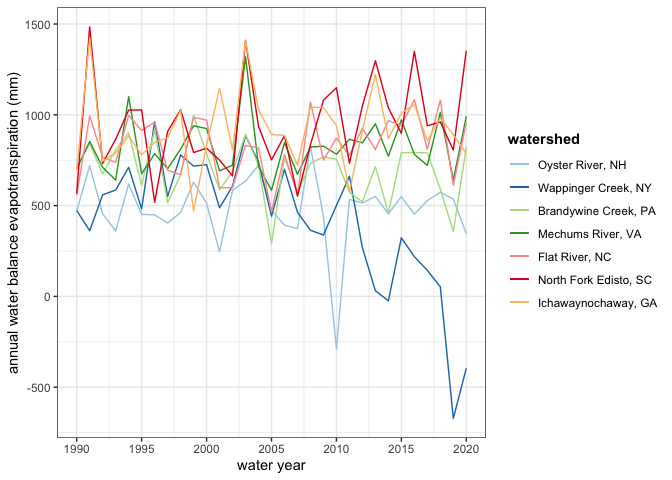

Figures and Figure Code
================

This is an R Markdown document of the process done to generate figures
for the project.

### Required packages and libraries:

``` r
library(tidyverse)
```

    ## ── Attaching packages ─────────────────────────────────────── tidyverse 1.3.2 ──
    ## ✔ ggplot2 3.4.0      ✔ purrr   0.3.5 
    ## ✔ tibble  3.1.8      ✔ dplyr   1.0.10
    ## ✔ tidyr   1.2.1      ✔ stringr 1.4.1 
    ## ✔ readr   2.1.3      ✔ forcats 0.5.2 
    ## ── Conflicts ────────────────────────────────────────── tidyverse_conflicts() ──
    ## ✖ dplyr::filter() masks stats::filter()
    ## ✖ dplyr::lag()    masks stats::lag()

``` r
library(ggplot2)
library(ggpubr)
```

### Read in the .csv files containing the data for each watershed:

``` r
# Note: file paths have to be changed by the user.

OysterNH_data <- read.csv("/Users/amyeldalecero/CEE_609_project/Model_train_and_validate_code/data/OysterNH_data.csv")
WappingerNY_data <- read.csv("/Users/amyeldalecero/CEE_609_project/Model_train_and_validate_code/data/WappingerNY_data.csv")
BrandywinePA_data <- read.csv("/Users/amyeldalecero/CEE_609_project/Model_train_and_validate_code/data/BrandywinePA_data.csv")
MechumsVA_data <- read.csv("/Users/amyeldalecero/CEE_609_project/Model_train_and_validate_code/data/MechumsVA_data.csv")
FlatNC_data <- read.csv("/Users/amyeldalecero/CEE_609_project/Model_train_and_validate_code/data/FlatNC_data.csv")
NorthForkSC_data <- read.csv("/Users/amyeldalecero/CEE_609_project/Model_train_and_validate_code/data/NorthForkSC_data.csv")
IchawayGA_data <- read.csv("/Users/amyeldalecero/CEE_609_project/Model_train_and_validate_code/data/IchawayGA_data.csv")
```

### Plot: Annual water balance ET of each watershed

``` r
annual_WB_ET <- ggplot() +
  geom_line(data = OysterNH_data, (aes(x = water_year, y = WB_annual_total_aet, color = "Oyster River, NH"))) +
  geom_line(data = WappingerNY_data, (aes(x = water_year, y = WB_annual_total_aet, color = "Wappinger Creek, NY"))) +
  geom_line(data = BrandywinePA_data, (aes(x = water_year, y = WB_annual_total_aet, color = "Brandywine Creek, PA"))) +
  geom_line(data = MechumsVA_data, (aes(x = water_year, y = WB_annual_total_aet, color = "Mechums River, VA"))) +
  geom_line(data = FlatNC_data, (aes(x = water_year, y = WB_annual_total_aet, color = "Flat River, NC"))) +
  geom_line(data = NorthForkSC_data, (aes(x = water_year, y = WB_annual_total_aet, color = "North Fork Edisto, SC"))) +
  geom_line(data = IchawayGA_data, (aes(x = water_year, y = WB_annual_total_aet, color = "Ichawaynochaway, GA"))) +
  
  scale_color_manual(name = "watershed",
                     values = c("Oyster River, NH" = "#a6cee3",
                                "Wappinger Creek, NY" = "#1f78b4",
                                "Brandywine Creek, PA" = "#b2df8a",
                                "Mechums River, VA" = "#33a02c",
                                "Flat River, NC" = "#fb9a99",
                                "North Fork Edisto, SC" = "#e31a1c",
                                "Ichawaynochaway, GA" = "#fdbf6f"),
                     breaks = c("Oyster River, NH",
                               "Wappinger Creek, NY",
                               "Brandywine Creek, PA",
                               "Mechums River, VA",
                               "Flat River, NC",
                               "North Fork Edisto, SC",
                               "Ichawaynochaway, GA")) +
  
  scale_x_continuous(breaks = seq(1990, 2020, 5)) +
  
  labs(x = "water year",
       y = "annual water balance evapotranspiration (mm)") +
  
  theme_bw() +
  
  theme(legend.title = element_text(face = "bold"))

annual_WB_ET
```

<!-- -->
**Caption:** Annual evapotranspiration from water years 1990-2020
computed using the water balance method

``` r
# Export the plot as tiff

ggsave(filename = "annual_WB_ET.tiff",
       plot = annual_WB_ET,
       device = "tiff",
       path = 'data',
       width = 8,
       height = 4,
       units = "in",
       dpi = 200)
```
